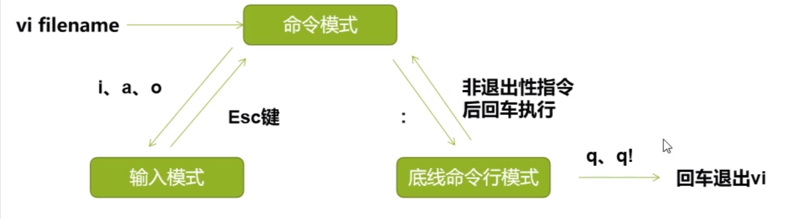

## 文件目录结构
```bash
dr-xr-xr-x.  25 root root 4.0K Oct 18 23:08 .
dr-xr-xr-x.  25 root root 4.0K Oct 18 23:08 ..
drwxr-xr-x    4 www  www  4.0K Oct 19 23:25 app
-rw-r--r--    1 root root    0 Jul  8 11:34 .autorelabel
lrwxrwxrwx    1 root root    7 Jun 22  2021 bin -> usr/bin # Binaries二进制的意思，一些命令文件
dr-xr-xr-x.   5 root root 4.0K Oct 18 17:53 boot  # 启动linux文件目录
drwxr-xr-x    3 root root 4.0K Jul  8 11:49 CloudResetPwdAgent
drwxr-xr-x    7 root root 4.0K Jul  8 11:49 CloudResetPwdUpdateAgent
drwxr-xr-x    6 root root 4.0K Jul  8 11:49 CloudrResetPwdAgent
drwxr-xr-x   19 root root 2.9K Oct 18 23:08 dev # 设备文件
drwxr-xr-x.  91 root root 4.0K Oct 18 23:22 etc # 主要放置应用配置文件
drwxr-xr-x.   3 root root 4.0K Oct 18 18:11 home  # 用户目录
lrwxrwxrwx    1 root root    7 Jun 22  2021 lib -> usr/lib
lrwxrwxrwx    1 root root    9 Jun 22  2021 lib64 -> usr/lib64
drwx------.   2 root root  16K Jul  8 11:25 lost+found
drwxr-xr-x.   2 root root 4.0K Jun 22  2021 media # 用于挂载的空目录
drwxr-xr-x.   2 root root 4.0K Jun 22  2021 mnt # 用于挂载的空目录
drwxr-xr-x.   2 root root 4.0K Jun 22  2021 opt # 用于挂载的空目录
drwxr-xr-x    2 root root 4.0K Oct 18 18:28 patch
-rw-r--r--    1 root root  195 Oct 18 18:32 .pearrc
dr-xr-xr-x  117 root root    0 Oct 18 23:08 proc # Process进程缩写，虚拟目录，系统内存的映射
drw-------    6 root root 4.0K Oct 20 00:36 .Recycle_bin
dr-xr-x---.   7 root root 4.0K Oct 28 00:10 root # root用户目录
drwxr-xr-x   27 root root  760 Oct 18 23:32 run # 系统启动和程序启动的运行时文件
lrwxrwxrwx    1 root root    8 Jun 22  2021 sbin -> usr/sbin # 管理员用户使用的命令
drwxr-xr-x.   2 root root 4.0K Jun 22  2021 srv
dr-xr-xr-x   13 root root    0 Oct 18 23:08 sys
drwxrwxrwt.   5 root root 4.0K Nov  2 18:27 tmp # temporary缩写，临时文件
drwxr-xr-x.  13 root root 4.0K Jul  8 11:43 usr # unix shared resources(共享资源)缩写，主要存放应用程序文件
drwxr-xr-x.  20 root root 4.0K Oct 18 18:25 var # variable(变量)的缩写，存放缓存和一些需要动态变化的文件
drwxr-xr-x    8 root root 4.0K Oct 18 22:46 www
```

### 首字母作用
* 文件的开头对应是 -
* 目录开头对应的是d
* 快捷方式对应的是l
* U盘对应的是b
* 鼠标键盘等硬件对应的c

### 权限
* 每三个一组rw-，-为缺少权限

RWX 分别是可读 可写 可执行权限

这个权限我们可以修改使用chmod 777 文件名

读------R对应数字4

写------W对应数字2

可执行-----X对应数字1

所以7就是可读可写可执行权限


### 第二列
* 代表你有多少文件 和目录里面有多少文件

### 第三列
* 创建该文件用户的名字  第二个是改文件所属用户组的名字
* 第一个就是用户名 第二个就是组名

### 第四列
* 表示改文件和文件夹所属的体积

### 第五列
* 创建改文件的日期

### 第六列
* 代表的就是文件或者文件夹等一系列的名称

### 字段说明
```bash
[root@ecs-87376 /]# ls -al
total 100
# 第一个字段
# d开头：目录 l开头：软连接  -开头：二进制文件
# r-xr-xr-x 权限

# 第二个字段 硬链接数量
# 目录类型：代表目录下文件数量
# 二进制文件：表示当前文件，显示为1
# 软链接：硬链接数量

# 第三四个字段 文件的所有者和所属组

# 第五个字段 文件的大小 单位字节

# 第六七八字段 文件创建时间

dr-xr-xr-x.  25 root root  4096 Oct 18 23:08 . # 单点代表当前目录
dr-xr-xr-x.  25 root root  4096 Oct 18 23:08 .. # 父级目录
drwxr-xr-x    4 www  www   4096 Oct 19 23:25 app
-rw-r--r--    1 root root     0 Jul  8 11:34 .autorelabel
lrwxrwxrwx    1 root root     7 Jun 22  2021 bin -> usr/bin

```

## ls
ls是list的缩写，就是列出当前目录下的文件信息

* -l选项：
  * l表示long,以长列表格式显示，加上-l选项可以获取文件的详细信息
* -a选项：
  * a表示all，表示显示所有文件（包括隐藏文件）
* -alh:
  * h 已人性化方式显示文件的大小


## cd
change directory, 变更目录   

## pwd
print working directory, 打印工作目录，显示当前所在目录的绝对路径

## cp
copy简写，复制文件的命令

* 用法1: cp SOURCE DEST(如果DEST不存在则创建，存在则覆盖)
* 用法2: cp SOURCE1 SOURCE2 SOURCE3 DEST (DEST必须为目录)
* 用法3: 使用cp拷贝目录， 加 -r 选项：表示递归

## mv 
move的简写，移动

* 用法1: mv SOURCE DEST(如果DEST不存在则创建，存在则覆盖)
* 用法2: mv SOURCE1 SOURCE2 SOURCE3 DEST (DEST必须为目录)
* 用法3: 使用mv移动目录
* 用法4: 重命名 `mv etc etc.bak`

> DEST 如果目标是个文件，会覆盖掉这个文件, 如果目录下有重名的也会被覆盖掉 

## touch
创建空文件

* 基本用法：
  * touch filename(不存在则创建、存在则修改最后访问日期)
* 扩展用法：快速创建多个文件
  * `touch file1 file2 file3`
  * `touch file{1..30}`
* 选项：
  * -t(time),我们指定一个touch的时间
  * `touch -t 12323444555 filename`

## mkdir
创建目录

* 基本用法：
  * `mkdir dirname`
* 扩展用法：快速创建多个目录
  * `mkdir dir1 dir2 dir3`
  * `mkdir dir{1..30}`
* 选项：
  * -p(parents), 父目录不存在时创建父目录
  * `mkdir -p abc/def/ghi`

## rm
删除文件或者目录

* 基本用法：
  * `rm filename`
* 选项：
  * -f: 就是force的意思，忽略不存在的文件，不会出现警告信息；
  * -r: 递归删除，最常用在目录的删除

> 注意：rm是高风险操作，使用该命令一定要紧绷神经，仔细再仔细
> 快速删除多个文件（删库跑路）：`rm -rf *`
> 还有一个rmdir的命令，但是只能用于删除空目录，平时不如rm实用，所以不常用，这里只是提一下。rmdir和mkdir一样可以接-p选项来递归删除目录

## cat
concatenate简写，连接的意思。显示文件全部内容

* 基本用法：
  * `cat filename` 必须为文本文件
* 选项：
  * -n: number的意思，显示行号 `cat -n filename`
* 使用技巧：
  * `cat -n file1 > file2` 显示file1的文件内容，并写入到file2
  * `cat file | grep -i word` 把file内容获取到，筛选出包含word的行内容， -i 不区分大小写

## head
显示文件内容的头部，默认显示文本文件的头10行

* 基本用法：
  * `head filename`
* 选项：
  * -n: number的意思，指定显示的行数 `head -n 5 file`
  * 或者直接用数字， 比如 `head -5 file`,表示显示file前5行

## tail
显示文件内容的尾部

* 基本用法：
  * `tail filename` 默认显示文本文件最后10行
* 选项：
  * -n 5 或 -5: 指定显示的行数
  * -f: follow的意思，实时显示最新增加到文件末尾的行，一般用于实时跟踪日志
* 示例：
  * `tail -f /var/log/message`

## more
分屏读取文件内容
* 基本用法：`more filename`
  * 前进一行：回车键
  * 前进一屏：空格键
  * 退出：q键（quit）
* 扩展用法：
  * `cat filename | more` 分屏显示文件内容
  * `history | more` 分屏显示历史命令

## less
更强大的分屏阅读
* 基本用法： `less filename`
  * 前进或后退一行：支持方向键 ⬆️ ⬇️
  * 前进后退一页：PgUp或b键（back）、PgDn或空格键
* 扩展用法：
  * `cat filename | less`
  * `history | less`
* 和more的区别：
  * more只能向下翻屏，使用less时，则可以随意上下翻看文件
  * cat和more会加载文件全部内容，less只加载要看的部分，看大文件有用


## vi vim
linux下的交互式文本编辑命令

* 特点：
  * Linux自带
  * 交互式（类似more、less）
  * 基础、强大
  * vim相当于 vi iMproved,加强版的vi
* 命令格式：
  * `vi filename`
  * `vim filename`
* 三大模式：
  * 命令模式
  * 输入模式
  * 底线命令行模式




* 命令模式下常用指令
  * i: 从光标当前位置插入，最常用
  * o: 从光标所在行之后插入空白行并从行开头开始编辑
  * h,j,k,l指令分别代表方向键左下上右，控制光标移动
  * x: 删除当前光标所在位置字符
  * dd: 删除当前光标所在的一整行
* 底线命令行模式下常用指令
  * :w 保存
  * :q 退出、如果加上“！”表示强制退出（未保存的内容会丢失）
* 扩展命令
  * 移动类
    * w,b 以单词为单位前进或者后退（用空格键区分）
    * 0, $ 分别快速定位到行首、和行尾
    * g、G分别快速定位到首行首字符、和尾行尾字符
    * H, M, L 分别快速定位到当前屏幕的首行（Head），中间(Middle),尾行(Last)
  * 查询类
    * / 表示向下查找一个关键字
    * ？表示向上查找一个关键字
  * 编辑类
    * r 替换一个字符；R替换多个字符，直到按Esc退出替换命令
    * yy 复制当前行的内容（到剪切板），p 粘贴到光标所在行
    * 3yy 表示复制以当前行开始的三行内容
    * dd 删除当前行，3dd删除以当前行开始的三行内容
    * x 删除当前光标所在字符，向后删；X删除光标当前所在位置前一个字符，向前删
    * conr + v 快模式

    插入
    * i 从光标当前位置插入
    * a 从光标后一个位置插入
    * A 移动到行尾并立即进入输入模式
    * C 删除光标所在位置到行尾的所有内容并立即进入输入模式

    撤销
    * u 操作错误时用来撤销上一步操作
    * Ctrl + r 反撤销
查找结果高亮显示，有多个结果，用n定位到下一个结果

vim练习工具： vimtutor


