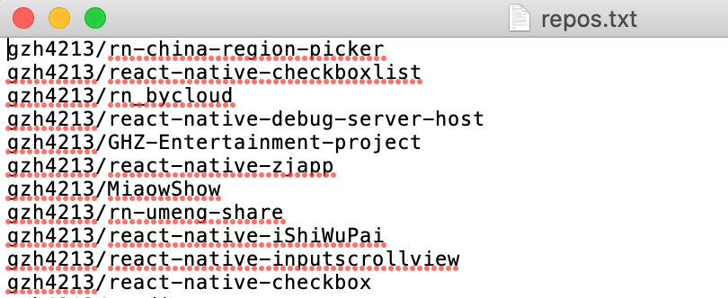
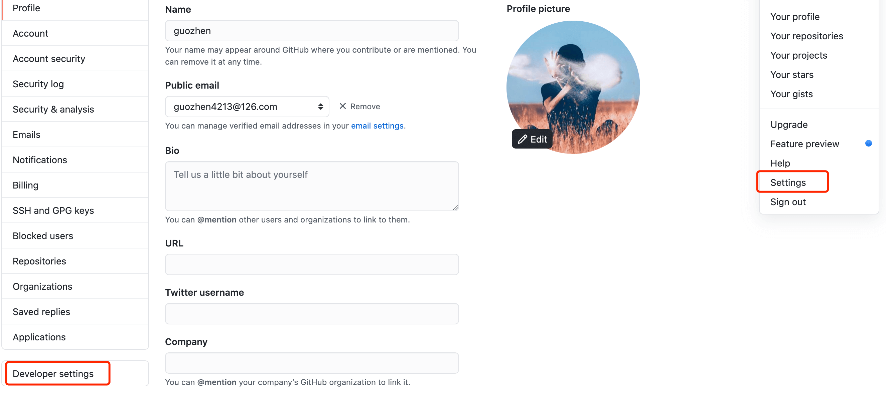
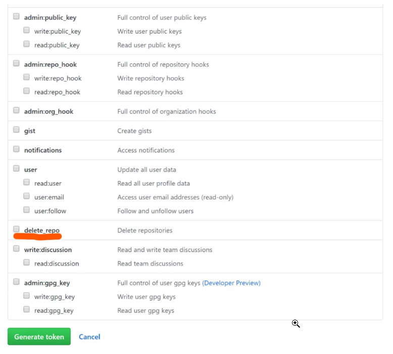

# github批量删除仓库

**1.将要删除的repos按照username\repos-name的格式以一行一个存放到文本文件中。**



**2.在GitHub上申请具有删除repos权限的token。**



<!--  -->

**3.在命令行中运行下面的命令：**
* Linux

```
while read r;do curl -XDELETE -H 'Authorization: token xxx' "https://api.github.com/repos/$r ";done < repo
```

* Window

```
[Net.ServicePointManager]::SecurityProtocol = [Net.SecurityProtocolType]::Tls12
sget-content D:\repolist.txt | ForEach-Object { Invoke-WebRequest -Uri https://api.github.com/repos/$_ -Method “DELETE” -Headers @{"Authorization"="token xxx"} }
```