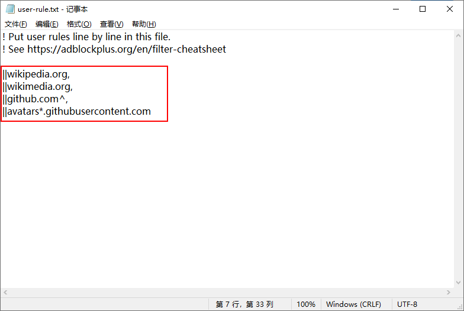

# GitHub和Wiki图片无法加载的PAC规则处理

以下方法对于 shadowsocks，ShadowsocksR 和 trojan 都适用：

在代理软件的功能设置里选择“编辑 GFWList 的用户规则”，关于 GWFList 的用户规则的说明见：shadowsocks-添加PAC自定义规则 。

在打开的用户规则编辑文件或者编辑窗口中，输入：

```
||wikipedia.org,
||wikimedia.org,
||github.com^,
||avatars*.githubusercontent.com
```

然后重启一下你的代理软件，bingo，你的 GitHub 图片就可以正常加载显示了。